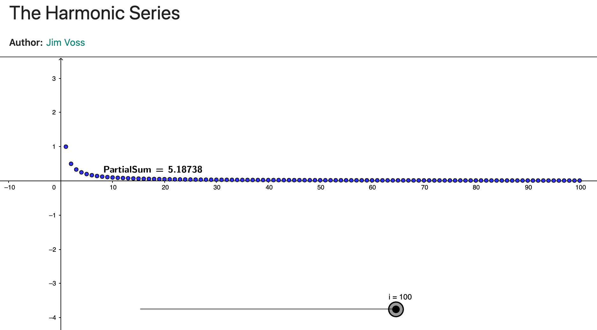
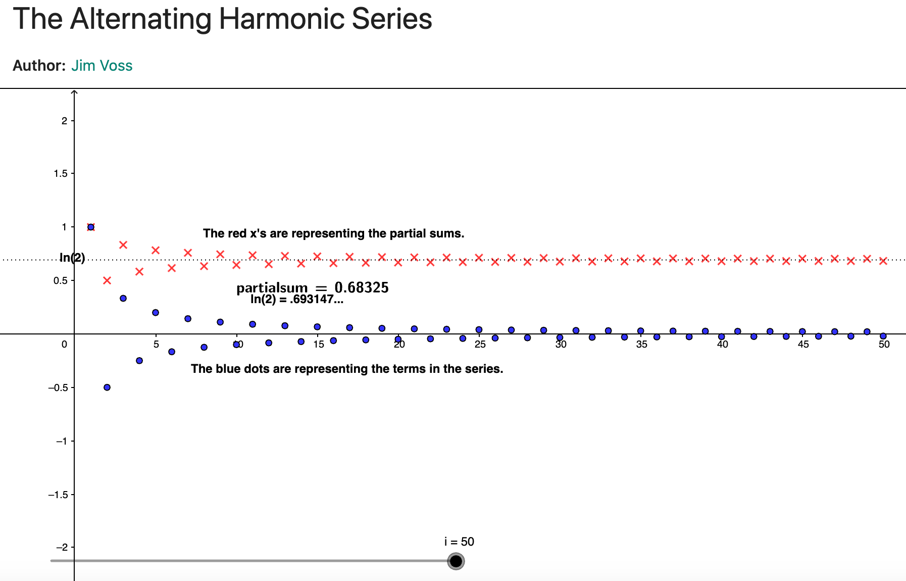

# calcII-challenge-problem

## Harmonic Series: ∑ (n=1 -> ∞) 1/n

..: 1/1 + 1/2 + 1/3 + 1/4 + 1/5 + 1/6 + 1/7 + 1/8 ... + 1/n-1 + 1/n
Ok So remember that the harmonic series DIVERGES to infinity.
This is because 1/n^P where P = 1 (in this case)
P >= 1 : DIV
P < 1 : CVG

## Alternating Harmonic Series: ∑ (n=1 -> ∞) ((-1)^(n+1))/n

..: 1/1 - 1/2 + 1/3 - 1/4 + 1/5 ... +-...

### Splitting apart the series into two groups

..: 1/1 + 1/3 + 1/5 + 1/7 .. + 1/2n-1
..: -1/2 - 1/4 - 1/6 - ... - 1/2n - ...
So we have 1/n and 1/n + 1
We know that 1/n > 1/n + 1
We also know that the lim n -> ∞ of 1/n = 0
So (0) > (lim n -> ∞ of 1/n + 1)
The Series CVG at ln(2).
\*Since the alternating harmonic series changes sign after every term the series converges due to the Alternating Series Test
This one is silly but will CVG! (Alternating Series Test)

## TO DO :

### Need to make the code to show this work

Do again with alternating harmonic series, which sums to ln 2. So you can see how soon to pass
.69, .693, .6931, etc. If you are going PAST the number, then automatically your last term is one
of the odd terms, 1/(2n-1), since you ADD to go larger than the sum. 4. Now mention that you can rearrange the alternating harmonic to converge to ANY number (the
first TARGET number). So the way this happens is you add odd terms to pass the TARGET
number (1 + 1/3 + 1/5 +1/7, etc to pass the number). At that point, you print the partial sum,
and k, the number of terms of ∑ 1
2𝑛𝑛−1
𝑘𝑘
𝑛𝑛=1 you used. In the code, you rename TARGET to be the
partial sum minus the old Target number. In other words, in successive runs, the TARGET is a
measurement of the error between the partial sum and the total sum, the original target. Then
you repeat with the new TARGET, the sum of even terms: ∑ 1
2𝑛𝑛
𝑗𝑗
𝑛𝑛=1 and these have to pass the
new TARGET amount (this takes only one term, usually). This will be ending up with a different
number of terms. The next step is create a new TARGET, same way. Then you start at the
counter k+1 to go past the new target. I think 5 passes (add odds, subtract evens, add odds,
subtract evens, add odds) should be enough for folks to understand what is going on.
//
For Calc 2 | Alternating Harmonic and slooooow convergence
Challenge problem: Alternating Harmonic and slooooow convergence 0. This presentation revolves around two series. First is the Harmonic Series, ∑ 1
𝑛𝑛
∞
𝑛𝑛=1 and the
second is the Alternating Harmonic Series ∑ (−1)𝑛𝑛+1
𝑛𝑛
∞
𝑛𝑛=1 . We know about the first at present and
Dr T will explain why the second converges next week.

1. Identify your platform (Matlab or what you are using). Remind students that the harmonic series
   diverges (p=1) and the alternating harmonic converges (by Alternating Series Test). Good to put
   these 2 series on a side board with their names (so they can follow your presentation on the doc
   cam/computer while keeping the series in mind).
2. Now use Matlab series option to show how slowly the harmonic series sums to infinity. A loop
   with input the partial sum you are passing (like, 12), and the output is the number of terms 𝑛𝑛 to
   pass that number.
3. Do again with alternating harmonic series, which sums to ln 2. So you can see how soon to pass
   .69, .693, .6931, etc. If you are going PAST the number, then automatically your last term is one
   of the odd terms, 1/(2n-1), since you ADD to go larger than the sum.
4. Now mention that you can rearrange the alternating harmonic to converge to ANY number (the
   first TARGET number). So the way this happens is you add odd terms to pass the TARGET
   number (1 + 1/3 + 1/5 +1/7, etc to pass the number). At that point, you print the partial sum,
   and k, the number of terms of ∑ 1
   2𝑛𝑛−1
   𝑘𝑘
   𝑛𝑛=1 you used. In the code, you rename TARGET to be the
   partial sum minus the old Target number. In other words, in successive runs, the TARGET is a
   measurement of the error between the partial sum and the total sum, the original target. Then
   you repeat with the new TARGET, the sum of even terms: ∑ 1
   2𝑛𝑛
   𝑗𝑗
   𝑛𝑛=1 and these have to pass the
   new TARGET amount (this takes only one term, usually). This will be ending up with a different
   number of terms. The next step is create a new TARGET, same way. Then you start at the
   counter k+1 to go past the new target. I think 5 passes (add odds, subtract evens, add odds,
   subtract evens, add odds) should be enough for folks to understand what is going on.
